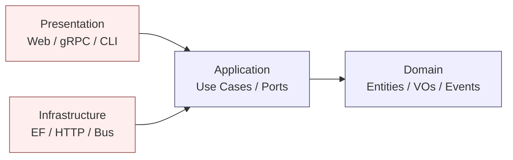

# Clean Architecture

> Concentric layers with a strict dependency rule: source-code dependencies point inward, toward the domain.

## Core Concepts

- **Domain** — entities, value objects, aggregates, domain events. No framework references.
- **Application** — use cases (commands/queries/handlers), ports (interfaces), policies.
- **Infrastructure** — adapters: EF Core, HTTP clients, message buses, file system.
- **Presentation** — Web API, gRPC, Blazor, CLI; thin translation layer.
- **Dependency Rule** — outer layers may reference inner; inner layers may not reference outer.
- **Anti-Corruption Layer (ACL)** — a translation barrier when integrating with a model you do not control.

## Layer Diagram



The arrows are *source-code references*. At runtime, the composition root wires concrete adapters into application ports.

## "To Be Dangerous" Cheatsheet

| Concept | Apply when | Avoid when |
|---|---|---|
| Strict layering | Long-lived business app, multiple delivery surfaces | Tiny CRUD app — overhead exceeds benefit |
| Use cases as classes | Behaviors are non-trivial, need testing in isolation | Pure read-through endpoints — Vertical Slice fits better |
| ACL | Integrating with a legacy or external bounded context | Internal model you fully control |
| Result types over exceptions | Expected business failures (validation, not-found) | Programmer errors; let exceptions surface |

## Quick Reference (namespace + folder layout)

```
src/
  MyApp.Domain/                 // entities, VOs, events, errors
    Users/
      User.cs
      UserId.cs
  MyApp.Application/            // use cases + ports
    Users/
      CreateUser/
        CreateUserCommand.cs
        CreateUserHandler.cs
      Abstractions/
        IUserRepository.cs
  MyApp.Infrastructure/         // adapters
    Persistence/
      UserRepository.cs
      AppDbContext.cs
  MyApp.Web/                    // composition root + endpoints
    Endpoints/
      UsersEndpoints.cs
    Program.cs
```

```csharp
// Dependency rule encoded in csproj:
// Application  references Domain
// Infrastructure references Application
// Web references Application + Infrastructure
// Domain references nothing
```

## Common Pitfalls

- **Anemic domain** — entities are bags of properties; behavior leaks into handlers.
- **Leaking EF entities** as DTOs to the web layer.
- **Application referencing Infrastructure** to "save a project."
- Over-abstracting — `IServiceServiceFactoryFactory` indirection with one implementation forever.
- Putting validation in the controller instead of the use case.

## Examples in this folder

- [`Domain/User.cs`](Domain/User.cs) — entity with invariants, no framework deps
- [`Application/CreateUserHandler.cs`](Application/CreateUserHandler.cs) — use case + port
- [`Infrastructure/UserRepository.cs`](Infrastructure/UserRepository.cs) — EF adapter
- [`Web/UsersEndpoints.cs`](Web/UsersEndpoints.cs) — Minimal API surface

## See also

- [`../HexagonalArchitecture`](../HexagonalArchitecture) — same idea, ports/adapters framing
- [`../DomainDrivenDesign`](../DomainDrivenDesign) — fills the Domain layer
- [`../VerticalSlice`](../VerticalSlice) — alternative organization
- [`../FitnessFunctions`](../FitnessFunctions) — enforce the dependency rule with tests
