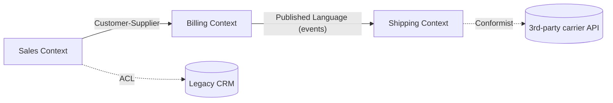

# Domain-Driven Design

> Build the model the business already speaks; align code, conversation, and bounded contexts.

## Core Concepts

- **Ubiquitous language** — one term, one meaning, inside one bounded context.
- **Bounded context** — an explicit boundary where a model is authoritative. Different contexts model the same real-world thing differently.
- **Entity** — identity persists across state changes.
- **Value object** — defined by its attributes; immutable; equality by value.
- **Aggregate** — a cluster of entities/VOs guarded by a single root that owns invariants and is the consistency boundary.
- **Domain event** — something the business cares about that *happened*, named in past tense.
- **Repository** — collection-like abstraction for one aggregate root; never expose `IQueryable` from the domain.
- **Factory** — creates valid aggregates when construction is non-trivial.
- **Anti-corruption layer** — translation barrier between contexts.

## Context Map (example)



## "To Be Dangerous" Cheatsheet

| Concept | Apply when | Avoid when |
|---|---|---|
| Tactical DDD (entities, VOs, aggregates) | Behavior-rich domain with invariants | CRUD-heavy app — Vertical Slice over CRUD |
| Strategic DDD (contexts, context map) | Multiple teams, multiple meanings of the same word | One team, one bounded context — implicit is fine |
| Aggregate as consistency boundary | You need a single transaction to keep an invariant | Aggregates spanning many tables/services |
| Domain events | Side-effects belong elsewhere; want decoupling | Trivial in-method follow-ups |

## Quick Reference

```csharp
// Aggregate root + value object + domain event.
public readonly record struct Money(decimal Amount, string Currency)
{
    public Money Add(Money other) =>
        Currency == other.Currency
            ? this with { Amount = Amount + other.Amount }
            : throw new InvalidOperationException("currency mismatch");
}

public sealed class Order
{
    public OrderId Id { get; }
    public Money Total { get; private set; }
    public bool Placed { get; private set; }
    private readonly List<object> _events = new();
    public IReadOnlyList<object> DomainEvents => _events;

    public void Place()
    {
        if (Placed) throw new InvalidOperationException("already placed");
        Placed = true;
        _events.Add(new OrderPlacedEvent(Id, Total, DateTimeOffset.UtcNow));
    }
}
```

## Common Pitfalls

- **Anemic domain model**: entities expose getters/setters and logic lives in services.
- **God aggregates**: an "Order" that owns customers, payments, and shipments.
- **Cross-aggregate transactions**: prefer eventual consistency between aggregates.
- **Generic ubiquitous language**: "Item", "Status", "Type" — names that survived because nobody pushed back.
- **Repository → ORM passthrough**: `OrderRepository.GetAll().Where(...)` is not a repository.

## Examples in this folder

- [`Order.cs`](Order.cs) — aggregate root with invariants and domain events
- [`OrderId.cs`](OrderId.cs) — typed identifier value object
- [`Money.cs`](Money.cs) — classic value object
- [`OrderPlacedEvent.cs`](OrderPlacedEvent.cs) — domain event

## See also

- [`../CleanArchitecture`](../CleanArchitecture) — DDD lives in the Domain layer
- [`../CQRS`](../CQRS) — separate read/write models around an aggregate
- [`../EventDriven`](../EventDriven) — domain events vs integration events
- [`../ModularMonolith`](../ModularMonolith) — one bounded context per module
