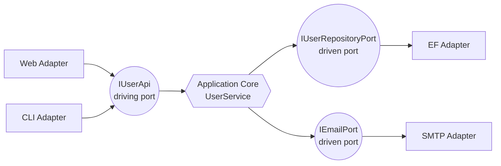

# Hexagonal Architecture (Ports and Adapters)

> Isolate the application core behind named ports; adapters connect those ports to the world.

## Core Concepts

- **Core / domain** — pure application logic. Knows nothing about HTTP, SQL, queues.
- **Port** — an interface owned by the core. Two flavors:
  - **Driving (primary, inbound)** — *the world calls us*: e.g. `IUserApi`.
  - **Driven (secondary, outbound)** — *we call the world*: e.g. `IUserRepositoryPort`.
- **Adapter** — concrete implementation of a port:
  - **Primary adapter** — Web controller, gRPC service, CLI, message consumer.
  - **Secondary adapter** — EF repository, HTTP client, Service Bus publisher.
- Same idea as Clean Architecture; hex framing makes the *symmetry* obvious: the core is testable in isolation by faking both kinds of ports.

## Diagram



## "To Be Dangerous" Cheatsheet

| Concept | Apply when | Avoid when |
|---|---|---|
| Driving port per use case | Stable, well-named API surface | Ad-hoc CRUD where REST already serves |
| Driven port per external concern | EF, HTTP, queue, time, randomness | The dependency is trivially pure |
| Test through the driving port | Acceptance / use-case tests | When end-to-end through HTTP is cheap enough |

## Quick Reference

```csharp
// Core
public interface IUserApi // driving
{
    Task<UserDto> RegisterAsync(string email, string name, CancellationToken ct);
}

public interface IUserRepositoryPort // driven
{
    Task AddAsync(User user, CancellationToken ct);
    Task<bool> ExistsByEmailAsync(string email, CancellationToken ct);
}

public sealed class UserService(IUserRepositoryPort repo) : IUserApi { /* … */ }
```

## Common Pitfalls

- Using "port" as a synonym for "interface in the same project as the implementation." Ports belong to the core.
- Letting adapters call each other directly — they should meet at the core.
- Modeling ports as anemic CRUD repositories that mirror the database 1:1.
- One driving port per HTTP route — collapse cohesive operations into one port.

## Examples in this folder

- [`IUserPort.cs`](IUserPort.cs) — driving port (inbound)
- [`IUserRepositoryPort.cs`](IUserRepositoryPort.cs) — driven port (outbound)
- [`UserService.cs`](UserService.cs) — core implementation
- [`WebUserAdapter.cs`](WebUserAdapter.cs) — primary adapter (Minimal API)
- [`EfUserAdapter.cs`](EfUserAdapter.cs) — secondary adapter (EF Core)

## See also

- [`../CleanArchitecture`](../CleanArchitecture) — same pattern, layer-cake framing
- [`../DomainDrivenDesign`](../DomainDrivenDesign) — the domain that lives inside the hexagon
- [`../FitnessFunctions`](../FitnessFunctions) — enforce "core does not reference adapters"
