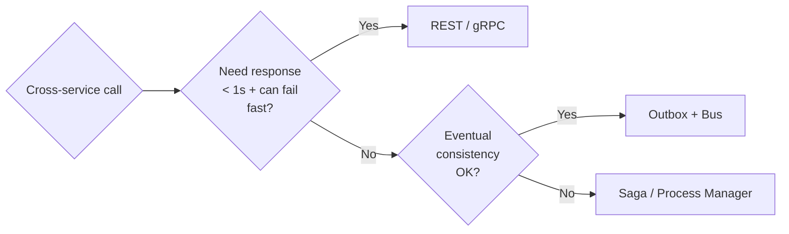

# Messaging

> Asynchronous integration between services. The non-negotiable patterns: **Outbox**, **Inbox**, **Idempotency**.

## Core Concepts

- **Command** — instruction to do work (1 producer → 1 consumer). Queue.
- **Event** — fact about what happened (1 producer → N consumers). Topic / pub-sub.
- **Outbox** — write the message to a DB table in the same TX as the business state change; a relay publishes. Solves "DB committed but bus call failed."
- **Inbox** — record processed message IDs to dedupe at-least-once delivery. Solves "consumer crashed mid-handle."
- **Idempotency keys** — for HTTP commands (e.g., payment charge); same key + same payload = same answer.
- **DLQ** — poison messages move out of the way after N attempts. Always alarm on DLQ depth.
- **Ordering** — only guaranteed within a partition/session. Design assuming out-of-order arrival.

## "To Be Dangerous" Cheatsheet

| Need | Choice |
|---|---|
| .NET-first, opinionated | **Wolverine** or **MassTransit** |
| Cloud queue | Azure Service Bus, AWS SQS/SNS, GCP Pub/Sub |
| Event log + replay | **Kafka** (or Azure Event Hubs Kafka API) |
| Streams of state changes | Kafka, Pulsar, or Redis Streams |
| Outbox table location | Same DB as the aggregate root |
| Idempotency at consumer | Inbox table keyed by `MessageId` |

## Decision (sync vs async)



## Quick Reference (MassTransit consumer + outbox)

```csharp
builder.Services.AddMassTransit(x =>
{
    x.AddConsumer<OrderPlacedConsumer>();

    x.AddEntityFrameworkOutbox<AppDbContext>(o =>
    {
        o.UseSqlServer();
        o.UseBusOutbox();
        o.QueryDelay = TimeSpan.FromSeconds(1);
    });

    x.UsingAzureServiceBus((ctx, cfg) =>
    {
        cfg.Host(builder.Configuration.GetConnectionString("ServiceBus"));
        cfg.ConfigureEndpoints(ctx);
    });
});
```

## Common Pitfalls

- Bus + DB without outbox → ghost events / lost events.
- Consumer that's not idempotent → at-least-once becomes at-multiple-times.
- DLQ that nobody monitors → silent data loss.
- Designing for in-order delivery globally → impossible at scale; partition properly.
- Same connection string read+write across services → coupling via DB instead of contracts.

## Examples in this folder

- [`MassTransitOutbox.cs`](MassTransitOutbox.cs) — full producer/consumer with EF Core outbox
- [`WolverineHandler.cs`](WolverineHandler.cs) — minimal handler
- [`InboxIdempotency.cs`](InboxIdempotency.cs) — manual inbox table + dedup

## See also

- [../Saga](../Saga/) · [../EventDriven](../EventDriven/) · [../../BackEnd/CSharp/Mediator](../../BackEnd/CSharp/Mediator/)
