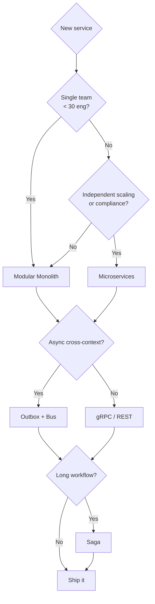

# Architecture

> Architectural styles, patterns, and reference implementations. The architect's distinguishing skill is **defensible judgment under uncertainty, written down**.

## "To Be Dangerous" Cheatsheet

| Decision | Default in 2026 |
|---|---|
| First architecture for a new system | **Modular monolith** (split only on evidence) |
| Service-to-service style (internal) | gRPC for hot paths; events for async |
| Service-to-service style (external) | REST + OpenAPI 3.1 |
| Boundaries | Bounded contexts (DDD) |
| Cross-cutting | Mediator + pipeline behaviors (validation, logging, transactions) |
| Communication | Outbox + Inbox; Saga for long workflows |
| Edge | YARP + per-tenant rate limit + auth |
| Modernization | Strangler Fig + ACL + expand-contract |
| Documentation | ADRs + C4 + threat models |

## Catalog

### Foundations
- [SOLID](SOLID/) · [DesignPatterns](DesignPatterns/)
- [CleanArchitecture](CleanArchitecture/) · [HexagonalArchitecture](HexagonalArchitecture/)
- [DomainDrivenDesign](DomainDrivenDesign/)

### Composition
- [VerticalSlice](VerticalSlice/) · [ModularMonolith](ModularMonolith/) · [Microservices](Microservices/)
- [CQRS](CQRS/) · [EventDriven](EventDriven/)

### Integration
- [ApiGateway](ApiGateway/) — YARP, BFF
- [Messaging](Messaging/) — outbox/inbox, MassTransit, Wolverine
- [Saga](Saga/) — orchestration vs choreography
- [StranglerFig](StranglerFig/) — modernization

### Discipline
- [FitnessFunctions](FitnessFunctions/) — NetArchTest, ArchUnitNET

## Decision tree

## See also

- [../Docs/ADRs](../Docs/ADRs/) · [../Docs/C4](../Docs/C4/) · [../Docs/Roadmaps/dotnet-2026-roadmap-senior-architect.md](../Docs/Roadmaps/dotnet-2026-roadmap-senior-architect.md)
