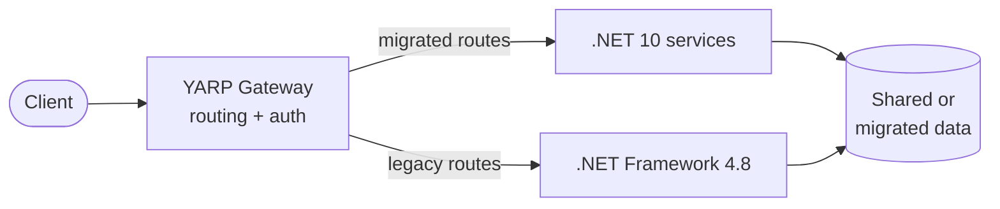

# Strangler Fig

> Replace the legacy by gradually routing new traffic to new services until the legacy is dead. Coined by Martin Fowler.

## Mechanics

## Discipline

- **Per-route cutover** — granular rollback
- **Dual-write windows** — when data layout changes (expand-contract)
- **Contract parity tests** — replay legacy traffic against new; diff responses
- **Feature flag at the gateway** — flip traffic instantly
- **No new functionality in the legacy after cutover starts** — freeze it

## "To Be Dangerous" Cheatsheet

| Need | Tool / pattern |
|---|---|
| Routing | YARP (`Architecture/ApiGateway`) |
| Data sync during cutover | CDC (Debezium) or dual writes |
| Auth across both | Dual auth — see `Security/Authentication/DualAuth` |
| Schema evolution | Expand-contract |
| Validation | Diff testing (record real legacy traffic, replay against new, compare) |

## Common Pitfalls

- "We'll cutover all routes in one big-bang" — that's not strangler, that's a forklift
- New service grows to depend on legacy DB internals → ACL leak
- Skipping rollback design → cutover becomes irreversible
- Strangling forever — set a sunset date and freeze the legacy

## See also

- [../../Modernization](../../Modernization/) · [../ApiGateway](../ApiGateway/) · [../../Security/Authentication/DualAuth](../../Security/Authentication/DualAuth/)
