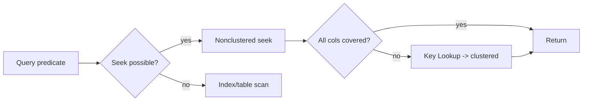

# Indexes

> Indexes are the single biggest lever for query performance. Pick the clustered key, design covering nonclustered, and measure with DMVs.

## Core Concepts

- **Clustered index**: defines physical row order (only one per table). Pick *narrow, unique, increasing, immutable*. Best fit: `bigint identity` or sequential GUID.
- **Nonclustered index**: separate B-tree, leaf points back to clustered key. Up to 999 per table.
- **Heap**: no clustered. Forwarding pointers + table scans = avoid.
- **Included columns** (`INCLUDE`): non-key columns stored at the leaf. Use to make the index "covering" without bloating the key.
- **Filtered index**: `WHERE` clause on the index. Great for `IsActive = 1`, `IsDeleted = 0`, `Status = 'Open'`.
- **Unique index**: enforces uniqueness AND is a query speedup. Always prefer over check constraints when both work.
- **Columnstore**: column-major storage, batch-mode execution, ~10x compression. Use for analytical fact tables.
- **Index intersection**: optimizer can use multiple nonclustered indexes; usually a sign one of them should be wider.

### Read path

## "To Be Dangerous" Cheatsheet

- **Covering index recipe**: key columns = `WHERE` + `JOIN` + `ORDER BY`, include = `SELECT`-list columns not in the key.
- **Leftmost prefix rule**: index `(A,B,C)` helps `WHERE A`, `WHERE A,B`, `WHERE A,B,C` - not `WHERE B`.
- **Filtered index** for sparse predicates: `CREATE INDEX IX ... WHERE IsActive = 1` - smaller, faster, and the optimizer matches the predicate exactly.
- **Don't index** every FK blindly - only those used in joins/filters. Each index taxes writes.
- **Sort hint**: matching `ORDER BY` to clustered key avoids a sort operator.
- **Page splits**: fillfactor 80-90 for hot tables; 100 for read-only/append-only.
- **`sys.dm_db_index_usage_stats`** + **`sys.dm_db_missing_index_details`** = the two DMVs you'll use weekly.
- **Columnstore on transactional tables**: nonclustered columnstore lets you keep OLTP rowstore + analytics in one table.
- Avoid **`newid()` clustered key** - random inserts cause page splits and fragmentation. Use sequential GUIDs (`NEWSEQUENTIALID()`) or `bigint identity`.

## Quick Reference

| Need | Index type |
|------|-----------|
| Primary key, mostly read by id | Clustered on id |
| `WHERE Status='Open'` (5% of rows) | Filtered nonclustered |
| `SELECT a,b,c WHERE x=?` | Nonclustered on `x` `INCLUDE (a,b,c)` |
| Full-text search | Full-text catalog |
| Aggregations on millions | Columnstore |
| Geometry / range | Spatial / R-tree |

## Common Pitfalls

- Functions on the indexed column kill seeks: `WHERE YEAR(CreatedUtc) = 2026` -> rewrite as range.
- Implicit conversion: `WHERE varcharCol = N'literal'` (note `N`) -> seek becomes scan.
- `SELECT *` defeats covering indexes.
- Too many indexes -> insert/update slowdowns and lock contention.
- Building indexes offline on hot tables -> use `WITH (ONLINE = ON, RESUMABLE = ON)`.
- Using `newid()` as clustered key on busy tables.

## Examples in this folder

- [Indexes.sql](./Indexes.sql) - clustered, covering, filtered, unique, columnstore.
- [IndexUsageQueries.sql](./IndexUsageQueries.sql) - DMV queries for missing/unused/duplicate indexes.

## See also

- [../README.md](../README.md)
- [../StoredProcedures/README.md](../StoredProcedures/README.md)
