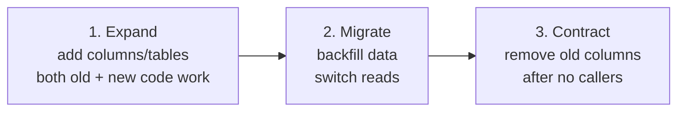

# SQL Server Migrations

> Online schema changes using **expand-contract**. Never combine expand and contract in the same release.

## Three phases



## Rules

1. **Expand is additive only.** New nullable columns, new tables. No drops, no NOT NULL on existing columns yet.
2. **Backfill in batches.** `WHERE pk BETWEEN @lo AND @hi` to avoid long locks.
3. **Switch reads carefully.** Feature flag the read path so you can rollback.
4. **Contract only after** every consumer has been updated AND you've validated for at least one full release cycle.
5. **Never edit applied migrations.** Add a new one to fix.

## Quick Reference

```sql
-- Phase 1: EXPAND
ALTER TABLE dbo.orders ADD is_active bit NULL;     -- nullable for now

-- Phase 2: BACKFILL (batched)
DECLARE @done bit = 0;
WHILE @done = 0
BEGIN
    UPDATE TOP (10000) dbo.orders
       SET is_active = 1
     WHERE is_active IS NULL;
    IF @@ROWCOUNT = 0 SET @done = 1;
    WAITFOR DELAY '00:00:00.250';
END;

ALTER TABLE dbo.orders ALTER COLUMN is_active bit NOT NULL;
ALTER TABLE dbo.orders ADD CONSTRAINT df_orders_isactive DEFAULT 1 FOR is_active;

-- Phase 3: CONTRACT (next release, after code references are gone)
ALTER TABLE dbo.orders DROP COLUMN legacy_status_text;
```

## EF Core 10

```bash
dotnet ef migrations add AddIsActive_Expand
dotnet ef database update
# release the app
# next release:
dotnet ef migrations add BackfillIsActive
# next release:
dotnet ef migrations add RemoveLegacyStatus_Contract
```

## Common Pitfalls

- Adding NOT NULL with a default in one statement on a huge table → blocking
- Editing an applied migration → drift between envs
- Skipping the backfill batch (`UPDATE everything`) → lock & log file blowup
- Migrations that take longer than the connection timeout → deploy fails

## See also

- [../README.md](../README.md) · [../../EntityFramework](../../EntityFramework/) · [../../../Modernization/MonolithToMicroservices](../../../Modernization/MonolithToMicroservices/)
