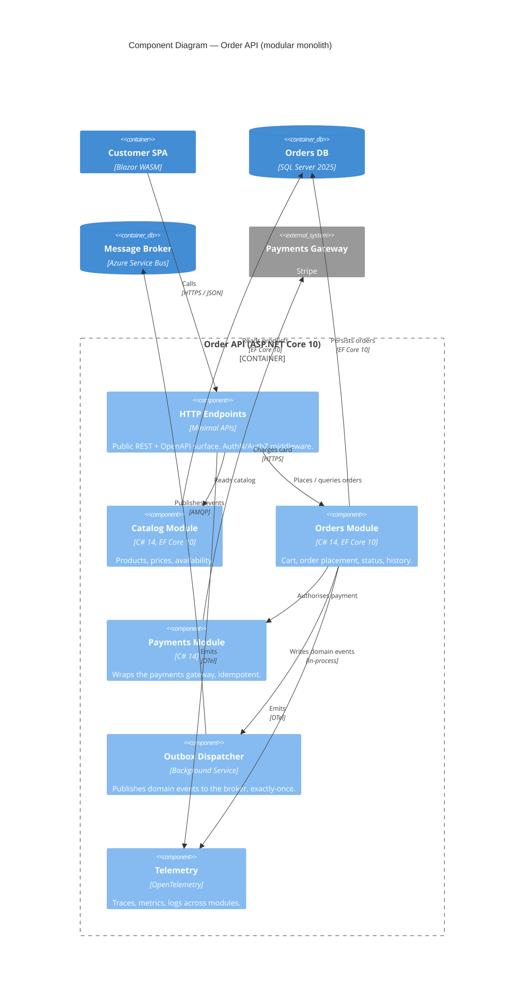

# C4 Level 3 — Component: Order API

> Zoom into the **Order API** container. Components are major logical groupings inside one process — typically aligned to bounded contexts in a modular monolith.

## Diagram

## Reading the diagram

- Each module is a project / namespace inside the same deployable. Boundaries are enforced with NetArchTest / ArchUnitNET.
- **Outbox pattern** is explicit: the Orders module never publishes to the broker directly; it writes events to its own DB, and the dispatcher relays them. This gives exactly-once semantics across the DB+broker boundary.
- **Telemetry** is shown as a component to make observability a first-class concern (per roadmap principle #8).

## See also

- [container-diagram.md](./container-diagram.md) — zoom out.
- [ADR 0003](../ADRs/0003-modular-monolith-default.md) — why modular monolith.
- [workspace.dsl](./workspace.dsl) — same components in Structurizr DSL.
