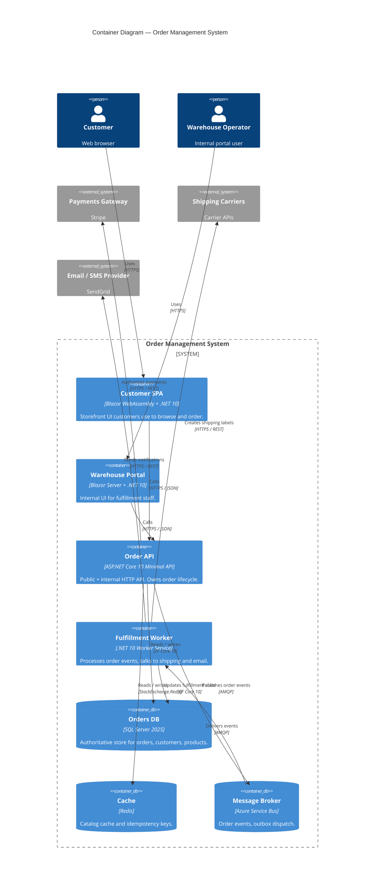

# C4 Level 2 — Container: Order Management System

> Zoom into the OMS box from Level 1. Each "container" is a separately deployable / runnable unit (a process, a database, a SPA bundle).

## Diagram

## Reading the diagram

- The OMS becomes seven containers: two UIs, one API, one worker, three stateful stores.
- **Synchronous** edges (HTTP, EF Core) and **asynchronous** edges (AMQP) are distinct — call them out in real diagrams with a legend if reviewers are unfamiliar.
- Per [ADR 0003](../ADRs/0003-modular-monolith-default.md), the API is a modular monolith inside one process — modules (Catalog, Orders, Payments, Shipping) are project references, not separate containers.

## See also

- [system-context.md](./system-context.md) — zoom out.
- [component-diagram.md](./component-diagram.md) — zoom into the Order API container.
- [workspace.dsl](./workspace.dsl) — same model in Structurizr DSL.
