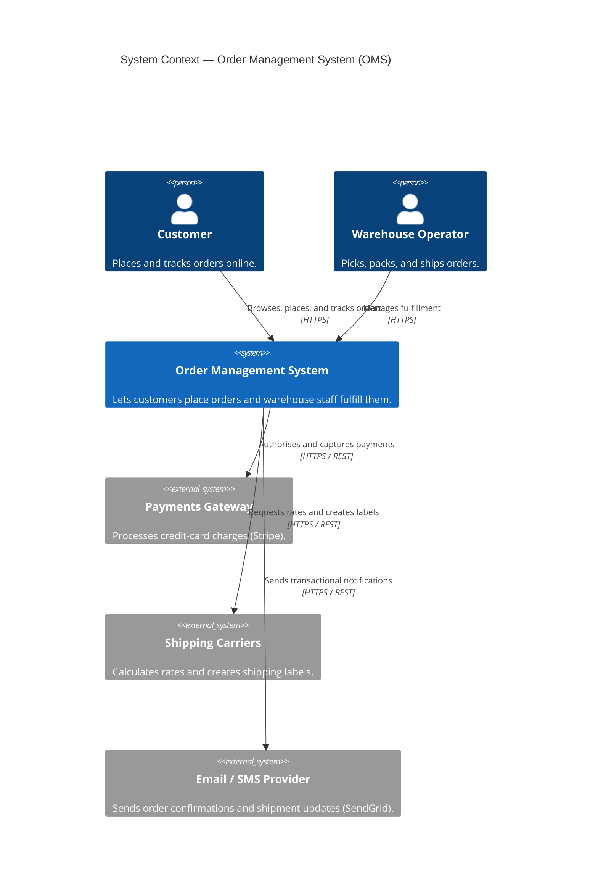

# C4 Level 1 — System Context: Order Management System

> One box for the system, plus the people and external systems that interact with it.

## Diagram

## Reading the diagram

- **One system, two user types, three external systems.** Anything outside the OMS box is "not our problem to build" — but it is our problem to integrate with.
- This is the diagram you put in front of a non-technical stakeholder. No technology choices appear yet.

## See also

- [container-diagram.md](./container-diagram.md) — zoom into the OMS box.
- [README.md](./README.md) — C4 model overview.
