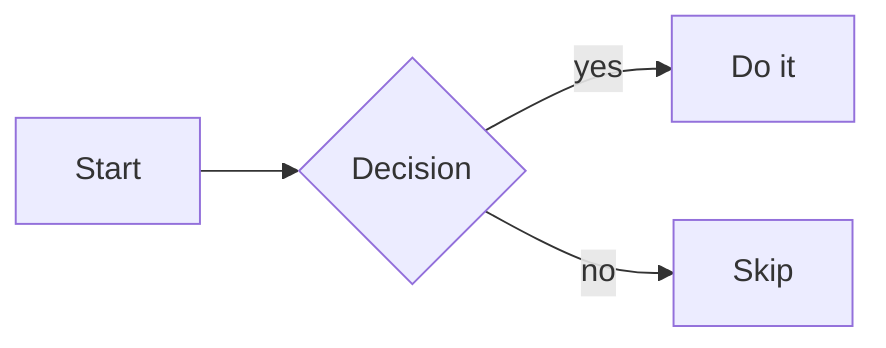
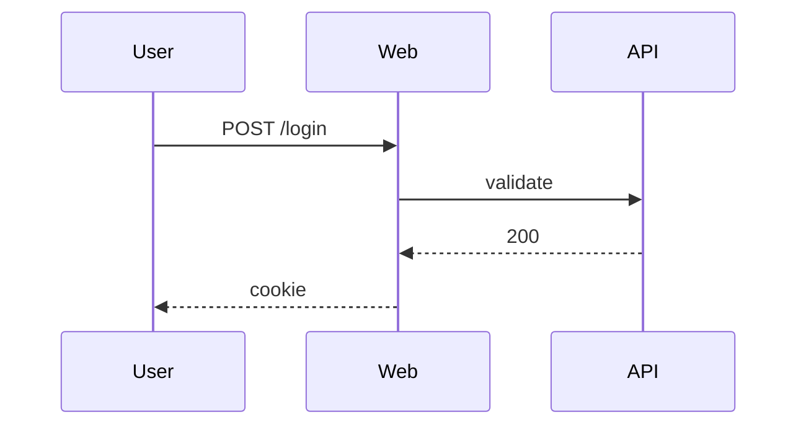
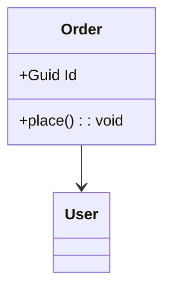
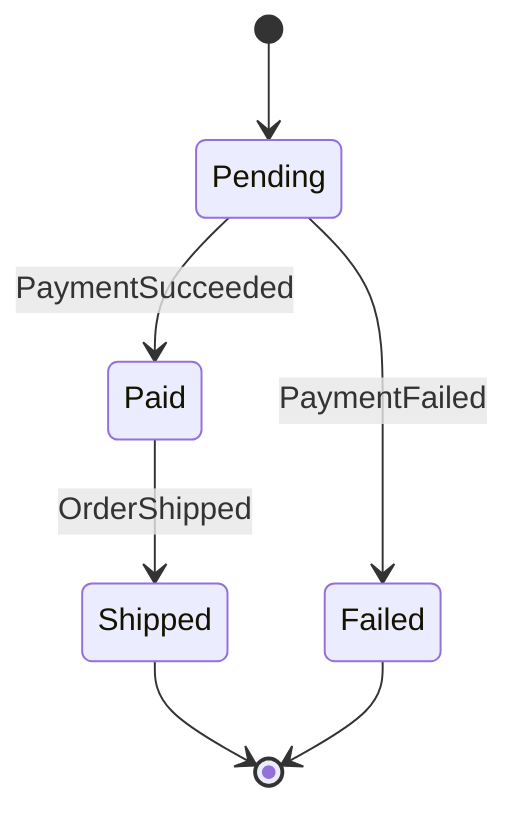
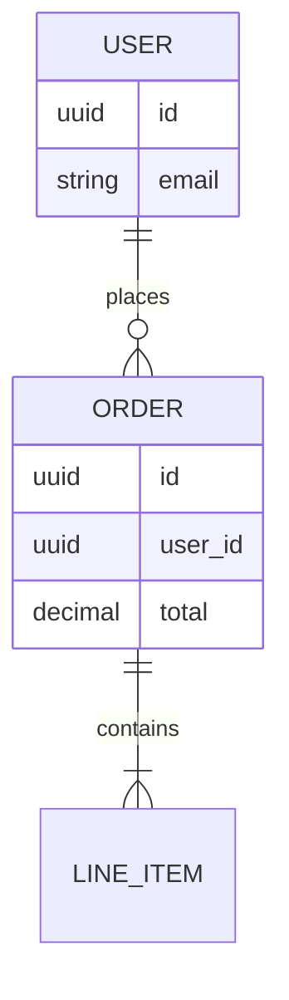
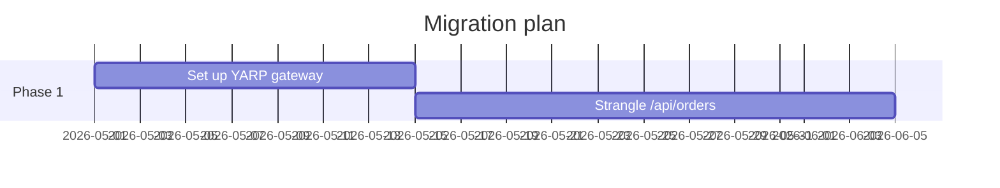
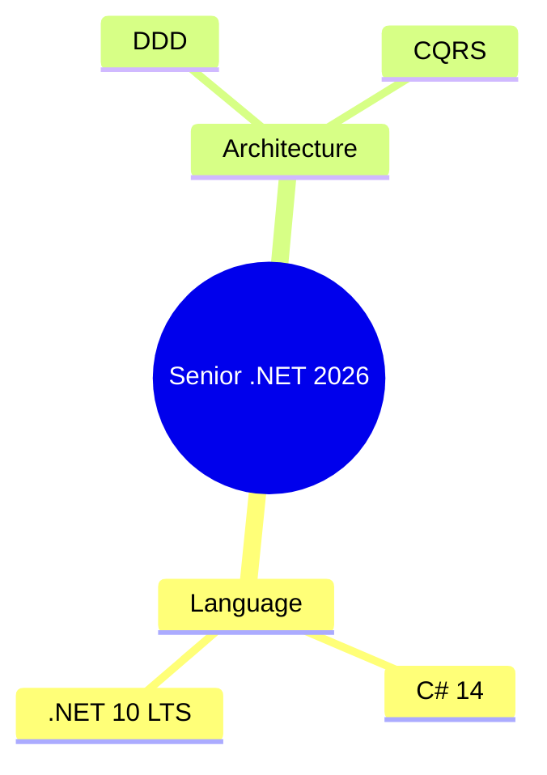
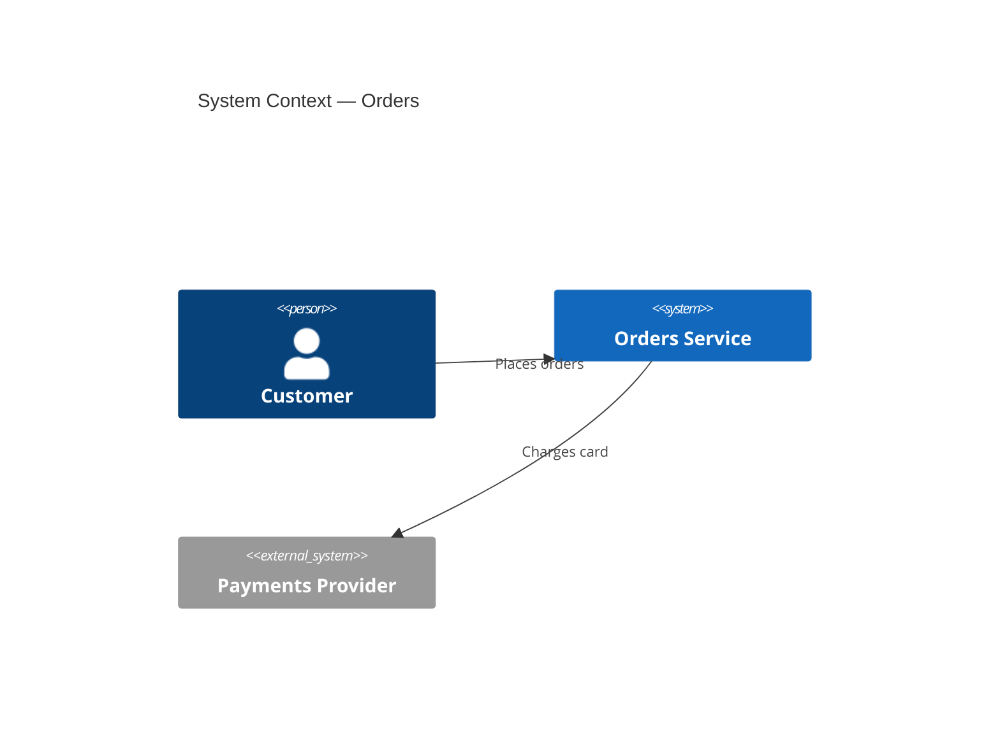

# Diagrams

> Mermaid first (renders in GitHub, Markdown, MkDocs). draw.io / Excalidraw for richer visuals. Structurizr DSL for C4.

## Mermaid types worth knowing

## Mermaid C4

## Cheatsheet — full reference

See [`mermaid-cheatsheet.md`](mermaid-cheatsheet.md) for an extended reference.

## See also

- [../C4](../C4/) · [../Templates](../Templates/) · [../../FrontEnd/HTML](../../FrontEnd/HTML/)
