# Mermaid Cheatsheet

> One working example per diagram type. Copy and adapt.

## 1. Flowchart

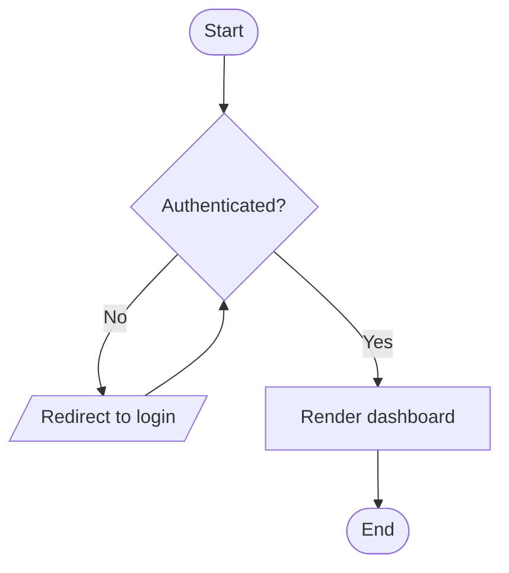

Directions: `TB` (top-bottom), `TD` (same), `BT`, `LR`, `RL`. Node shapes: `[]` rect, `()` round, `([])` stadium, `[[]]` subroutine, `[()]` cylinder, `(())` circle, `{}` diamond, `[/.../]` parallelogram.

## 2. Sequence

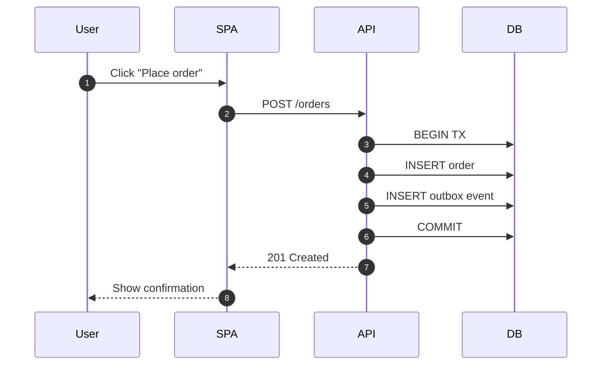

Use `->>` for sync, `-->>` for response, `-)` for async fire-and-forget. `Note over A,D: ...` for callouts. `loop`, `alt/else`, `par/and` for control flow.

## 3. Class

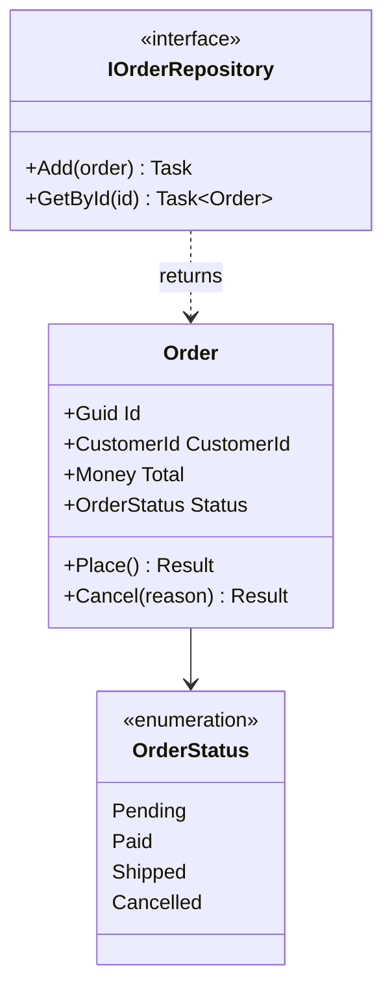

## 4. State

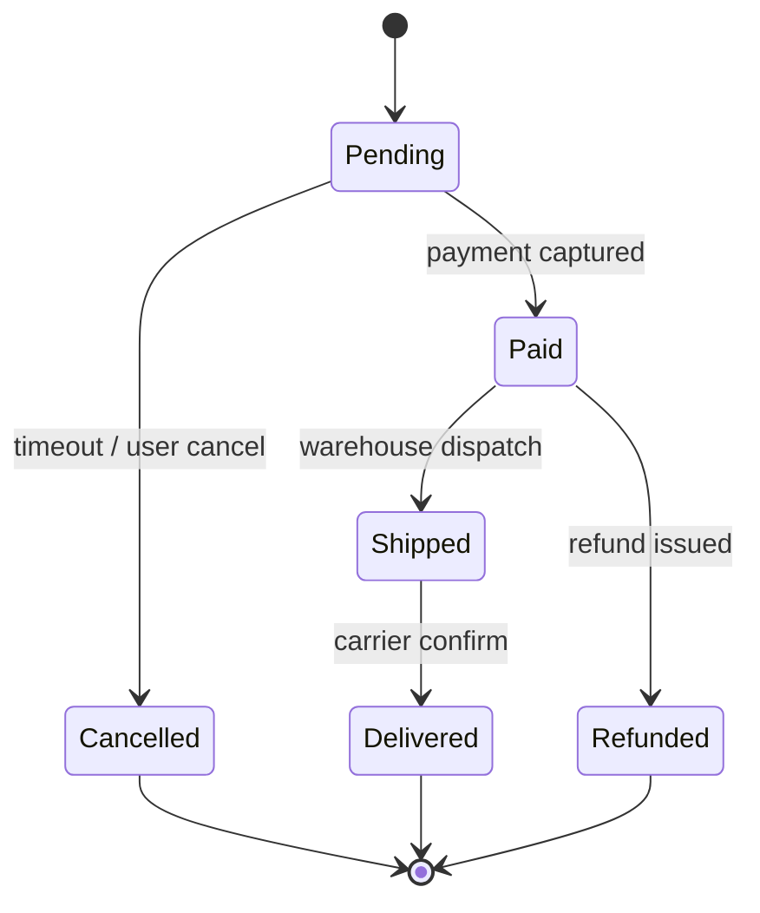

## 5. Entity-Relationship

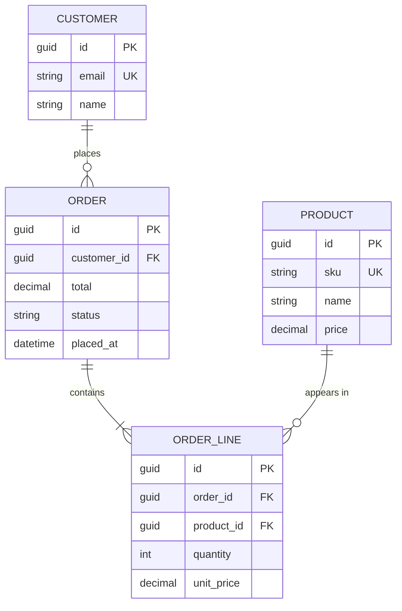

Cardinality: `||--||` one-to-one, `||--o{` one-to-many, `}o--o{` many-to-many; `o` = zero, `|` = exactly one.

## 6. Gantt

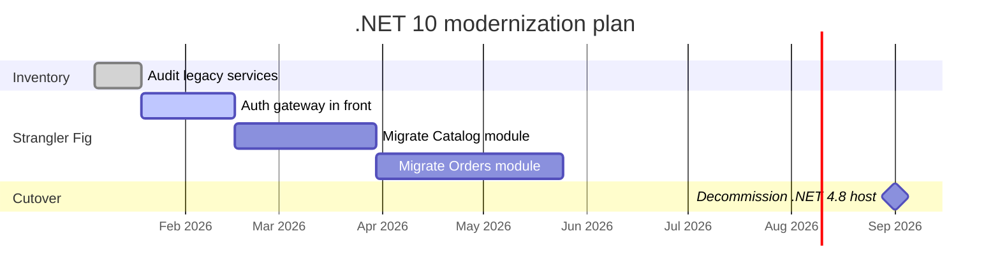

## 7. Mindmap

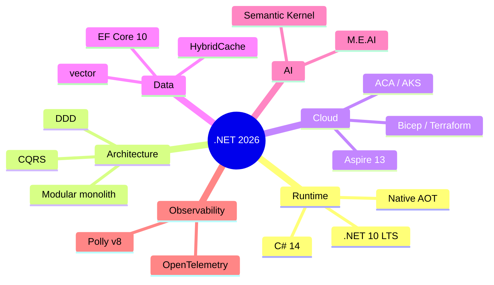

## 8. Journey

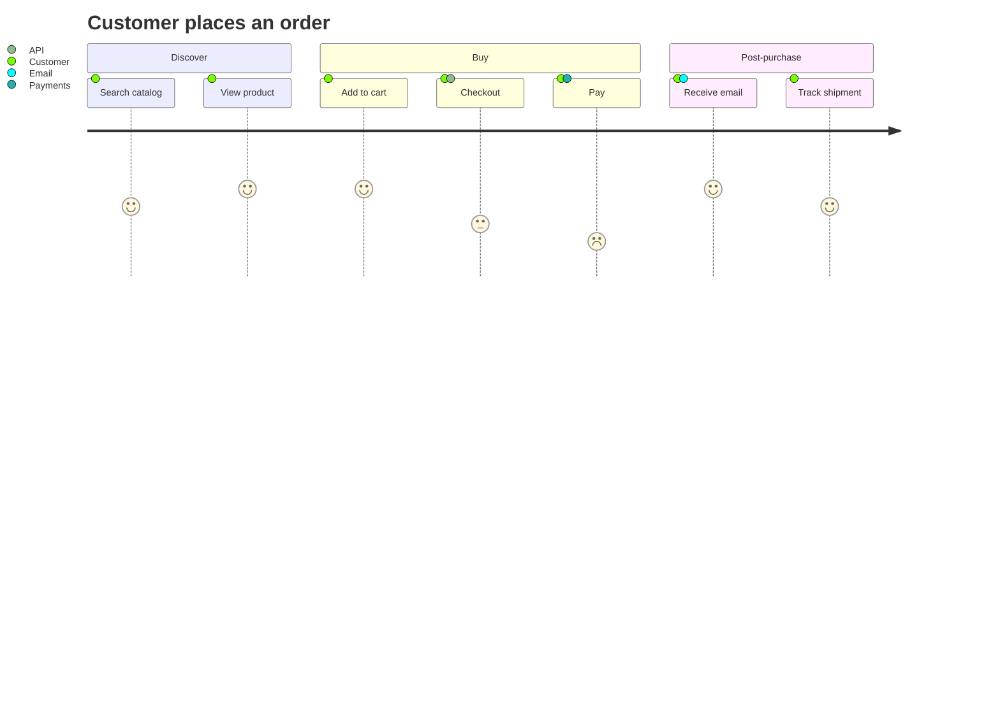

## 9. C4 (Container)

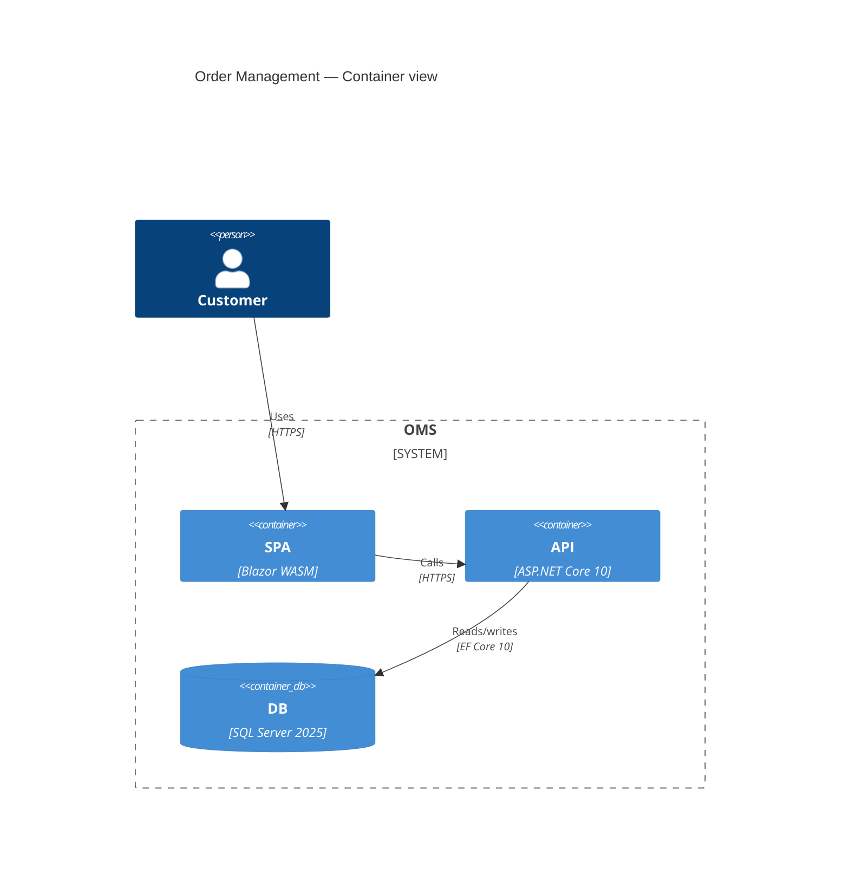

See [Docs/C4](../C4/README.md) for full Context/Container/Component diagrams.

## 10. Pie

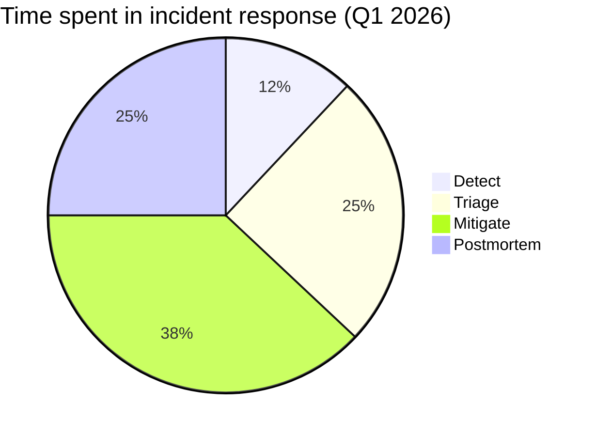

## 11. Git Graph

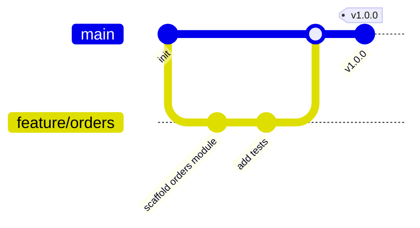

## See also

- [Mermaid live editor](https://mermaid.live)
- [README.md](./README.md) for embed-vs-file guidance.
