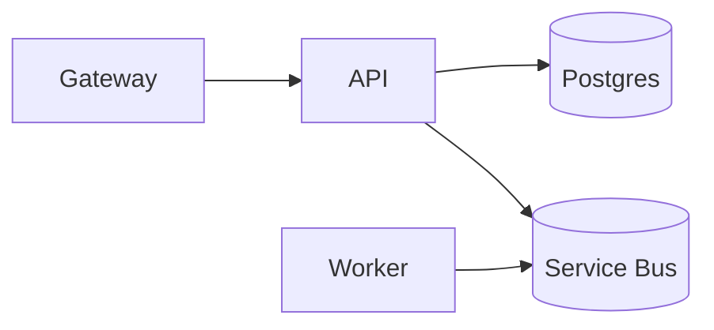

# <service-name>

> One-line description.

| | |
|---|---|
| **Owner** | team@example.com |
| **On-call** | PagerDuty / channel |
| **SLOs** | 99.9% availability, p99 < 300ms |
| **Repo** | github.com/... |
| **Dashboards** | grafana.../d/... |
| **Runbooks** | [./runbooks](./runbooks) |
| **Threat model** | [./THREAT_MODEL.md](./THREAT_MODEL.md) |
| **ADRs** | [./docs/adr](./docs/adr) |
| **Architecture** | [./docs/c4](./docs/c4) |

## What it does

A few sentences for a new engineer.

## Architecture



## Local dev

```bash
dotnet run
# or
docker compose up
```

## Configuration

| Key | Description | Default |
|---|---|---|
| `Db:ConnectionString` | Postgres conn | _required_ |
| `Otel:Endpoint`       | OTLP target  | http://localhost:4317 |

## Deploy

- CI: `.github/workflows/ci.yml`
- Release: `.github/workflows/release.yml` (manual)
- Environments: dev, staging, prod

## Observability

- Logs: structured, OTel via Serilog → Loki
- Metrics: OTel `Meter` → Prometheus
- Traces: `ActivitySource` → Tempo
- Dashboards: link

## Security

- Auth: OIDC via Entra
- Secrets: Key Vault via managed identity
- Threat model: `./THREAT_MODEL.md`

## Testing

```bash
dotnet test
```

## Contributing

Conventional Commits. Trunk-based. Architecture tests must pass.
