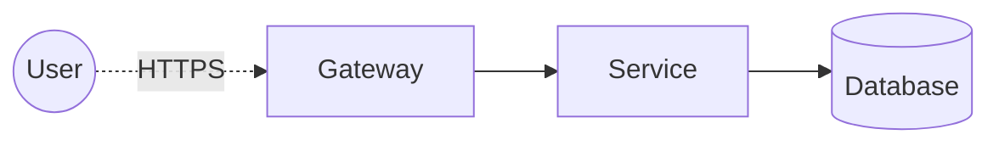

# Threat Model — <Service / Bounded Context>

**Status:** Draft / Accepted · **Owner:** ... · **Last review:** YYYY-MM-DD

## Scope

What is in scope? What is explicitly out?

## Assets

- ...
- ...

## Trust boundaries

## STRIDE per element

### Flow: <name>

| Threat | Description | Mitigation | Residual |
|---|---|---|---|
| S | | | |
| T | | | |
| R | | | |
| I | | | |
| D | | | |
| E | | | |

(repeat for each flow)

## Action items

- [ ] ...
- [ ] ...

## Review cadence

Quarterly + on any change crossing a trust boundary.
