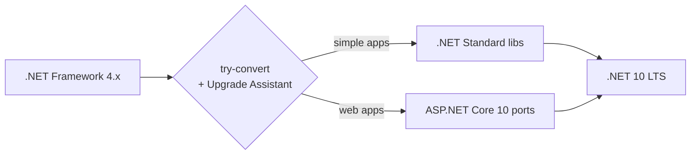

# .NET Framework → .NET 10

> The compounding risk: .NET Framework is in extended-only servicing. Modernize on a cadence, not a panic.

## Pathway

## Tooling

| Tool | Purpose |
|---|---|
| **`dotnet upgrade-assistant`** | Interactive analyzer + upgrader; recommends fixes |
| **`try-convert`** | Convert old `.csproj` to SDK-style |
| **API Compatibility analyzers** | Highlight removed APIs |
| **`Microsoft.Windows.Compatibility`** | Backports many `System.*` types missing on .NET Core/.NET |

## Common breakages

| .NET Framework | .NET 10 |
|---|---|
| `System.Web.HttpContext` | `Microsoft.AspNetCore.Http.HttpContext` (different shape) |
| `ConfigurationManager` | `IConfiguration` (DI) |
| `AppDomain.CurrentDomain.Load` | `AssemblyLoadContext` |
| `BinaryFormatter` | **Removed** — switch to JSON / MessagePack / Protobuf |
| `WebClient` | `HttpClient` via `IHttpClientFactory` |
| WCF service host | gRPC / Minimal API / `CoreWCF` for legacy contracts |
| Web Forms / `*.aspx` | Blazor / Razor Pages / SPA + API |
| `System.Configuration.ConfigurationSection` | Options pattern (`IOptions<T>`) |
| `EF6` | EF Core 10 (different API surface; expect porting) |

## "To Be Dangerous" Cheatsheet

| Step | Command |
|---|---|
| Install | `dotnet tool install -g upgrade-assistant` |
| Analyze | `upgrade-assistant analyze <path>` |
| Upgrade | `upgrade-assistant upgrade <path>` |
| Convert csproj | `dotnet tool install -g try-convert` then `try-convert -p <project>` |
| Multi-target | `<TargetFrameworks>net10.0;net48</TargetFrameworks>` for libraries |

## Strangler approach

1. Stand up .NET 10 ports of services next to the legacy app.
2. Put **YARP** in front; route migrated paths to new, fall through to legacy.
3. Move data via **expand-contract** when schemas change.
4. Cut over per route; rollback at the gateway.

## Common Pitfalls

- Forklift rewrites with no traffic until the end → integration shocks.
- Skipping multi-target on shared libs → forced cutover before all callers ready.
- `BinaryFormatter` payloads in storage → can't be deserialized post-upgrade. Migrate format first.
- IIS-specific behavior (modules, request lifecycle) → not all maps to ASP.NET Core middleware.

## Examples in this folder

- [`upgrade-checklist.md`](upgrade-checklist.md)
- [`csproj-before.csproj`](csproj-before.csproj) · [`csproj-after.csproj`](csproj-after.csproj)

## See also

- [../WcfToAspNetCore](../WcfToAspNetCore/) · [../WebFormsToBlazor](../WebFormsToBlazor/) · [../../Architecture/StranglerFig](../../Architecture/StranglerFig/)
