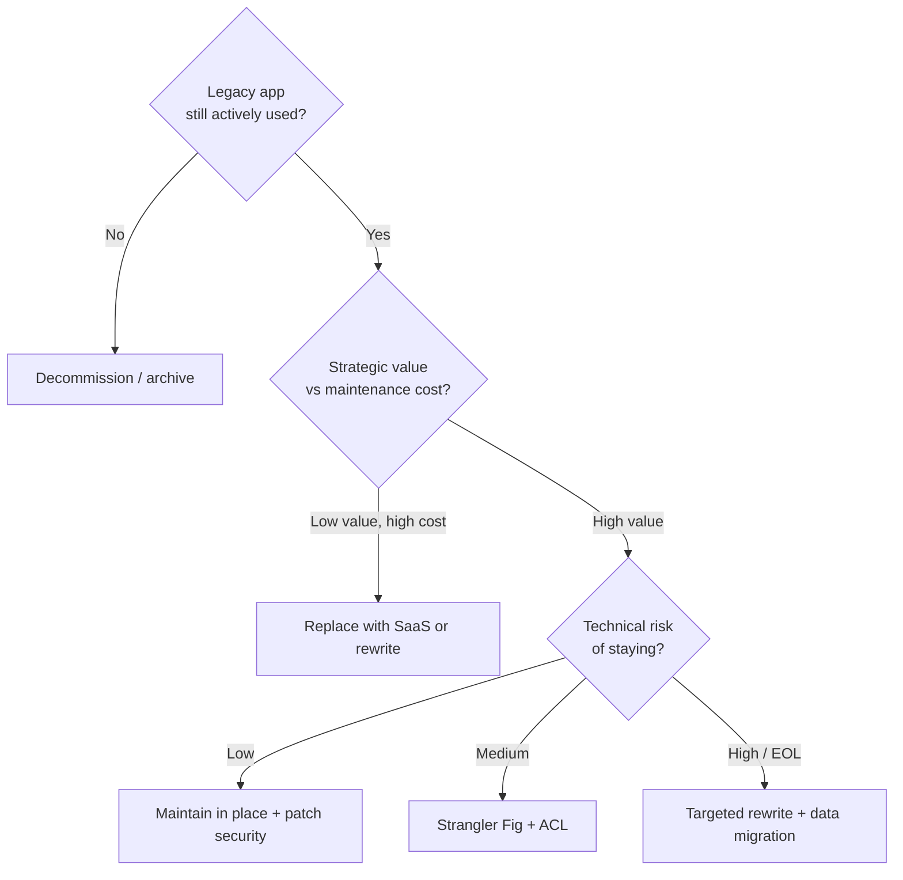

# Modernization

> Legacy → modern migration patterns. Strangler Fig is the throughline. Cadence beats panic.

## "To Be Dangerous" Cheatsheet

| Pattern | When |
|---|---|
| **Strangler Fig** | Replace legacy by routing new paths to new services through a gateway (YARP) |
| **Branch by Abstraction** | In-process refactor — abstraction in front of old + new impl, swap, delete old |
| **Anti-Corruption Layer (ACL)** | Translate at the boundary so the legacy model never leaks into the new core |
| **Expand-Contract** | Online schema migration: add → backfill → switch reads → drop |
| **Dual Auth** | Run legacy IdP and modern OIDC in parallel during the migration window |
| **CDC** | Change data capture to keep parallel data stores in sync during cutover |

## Decision tree

## Catalog

- [WebFormsToBlazor](WebFormsToBlazor/) · [WcfToAspNetCore](WcfToAspNetCore/) · [SoapToRest](SoapToRest/)
- [MonolithToMicroservices](MonolithToMicroservices/) · [DotNetFrameworkToNet10](DotNetFrameworkToNet10/)
- [SawToEntraExternalId](SawToEntraExternalId/) — SAML/SAW → Entra External ID
- [TfsToAzureGit](TfsToAzureGit/)

## Common Pitfalls

- Forklift rewrites without dual-running → integration shocks at cutover
- "We'll modernize next quarter" for 8 quarters → compounding risk
- Modern app keeps legacy data shape forever → ACL was supposed to be temporary
- No rollback strategy → every cutover is a one-way door

## See also

- [../Architecture/StranglerFig](../Architecture/StranglerFig/) · [../Docs/Roadmaps](../Docs/Roadmaps/)
