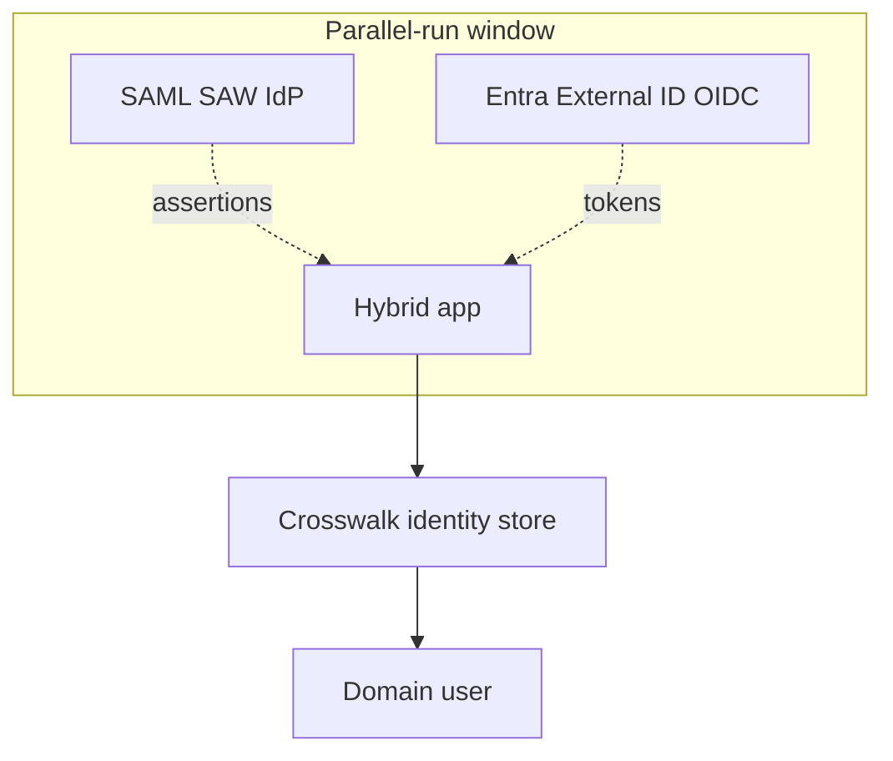

# SAW / SAML → Entra External ID

> Government / enterprise federations migrating from a SAML-based "single access way" (SAW) to a modern OIDC CIAM (Entra External ID).

## Why now

- SAML is fine but heavy; OIDC + JWT is the new lingua franca
- Entra External ID adds passkeys / FIDO2, custom claims providers, custom domains
- Long-term maintenance: fewer specialists for SAML each year

## Migration approach

## Steps

1. **Stand up Entra External ID** with the user flows you'll need (sign-in, sign-up, MFA, passkey).
2. **Create a crosswalk store** keyed by `legacy_saml_subject` ↔ `entra_oid`. Populate as users sign in.
3. **Add OIDC** alongside SAML. App accepts either; merges into a single domain identity via the crosswalk.
4. **Encourage / require** users to sign in with the new IdP. Flip new sign-ups to Entra-only first.
5. **Sunset SAML** by date. Force migration paths for stragglers.

## Claim mapping (typical)

| SAML | OIDC (Entra External ID) | Domain claim |
|---|---|---|
| `NameID` (transient/persistent) | `oid` (object id) | `userId` |
| `http://schemas.xmlsoap.org/.../emailaddress` | `email` (or via custom claim) | `email` |
| `http://schemas.microsoft.com/.../role` | `roles` (app role) | `role` |
| `http://schemas.microsoft.com/.../upn` | `preferred_username` | `upn` |

## "To Be Dangerous" Cheatsheet

| Need | Implementation |
|---|---|
| Multi-scheme auth | `AddAuthentication().AddOpenIdConnect("oidc", ...).AddSaml2("saml", ...)` |
| Crosswalk insertion | On first OIDC login of an existing SAML user, link by verified email |
| Custom claims | Entra External ID custom claims provider (REST endpoint) |
| Passkeys | Built into Entra External ID |
| Sunset banner | Render "we're switching auth providers" UI ahead of cutoff |

## Common Pitfalls

- Cutting over without a parallel run → mass lockouts
- Email-based linking without verifying the email at the new IdP → account takeover
- Forgetting to migrate downstream service-to-service auth (legacy SAML to OAuth2 client_credentials) → broken integrations
- No "I changed providers, please relink" recovery flow for stragglers

## See also

- [../../Security/Authentication/Entra](../../Security/Authentication/Entra/) · [../../Security/Authentication/SAML](../../Security/Authentication/SAML/) · [../../Security/Authentication/DualAuth](../../Security/Authentication/DualAuth/)
