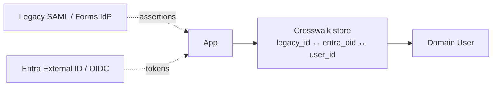

# Dual Authentication (legacy + modern in parallel)

> The migration pattern — legacy IdP and modern OIDC running side-by-side, with a crosswalk store linking identities.

## Why

You can't cut over thousands of users in one weekend. You need:
- Legacy clients to keep working
- New clients to use modern OIDC
- Both to resolve to **the same domain user**

## Architecture



## ASP.NET Core 10 sketch — multi-scheme

```csharp
builder.Services
    .AddAuthentication()
    .AddCookie("legacy")
    .AddOpenIdConnect("oidc", o =>
    {
        o.Authority = "https://login.example.com/v2.0";
        o.ClientId = builder.Configuration["Oidc:ClientId"];
        o.SignInScheme = "cookies";
    })
    .AddCookie("cookies");

builder.Services.AddAuthorization(o =>
{
    o.DefaultPolicy = new AuthorizationPolicyBuilder("legacy", "oidc", "cookies")
        .RequireAuthenticatedUser()
        .Build();
});

// Crosswalk lookup in a claims-transformer
builder.Services.AddScoped<IClaimsTransformation, CrosswalkClaimsTransformer>();

public sealed class CrosswalkClaimsTransformer(IUserCrosswalk xw) : IClaimsTransformation
{
    public async Task<ClaimsPrincipal> TransformAsync(ClaimsPrincipal principal)
    {
        if (principal.HasClaim(c => c.Type == "user_id")) return principal;

        var key = principal.FindFirst("sub")?.Value      // OIDC subject
              ?? principal.FindFirst("nameid")?.Value;   // SAML nameid mapped to claim
        if (key is null) return principal;

        var userId = await xw.ResolveAsync(principal.Identity!.AuthenticationType!, key);
        if (userId is { } id)
        {
            var clone = principal.Clone();
            ((ClaimsIdentity)clone.Identity!).AddClaim(new Claim("user_id", id.ToString()));
            return clone;
        }
        return principal;
    }
}

public interface IUserCrosswalk
{
    Task<Guid?> ResolveAsync(string scheme, string externalKey);
}
```

## Crosswalk schema

```sql
CREATE TABLE user_external_ids (
    user_id      uuid NOT NULL REFERENCES users(id),
    provider     text NOT NULL,        -- 'legacy-saml', 'oidc-entra', etc.
    external_id  text NOT NULL,
    linked_at    timestamptz NOT NULL DEFAULT now(),
    PRIMARY KEY (provider, external_id)
);
```

## Process

1. **First OIDC login** of an existing legacy user → verify email match → write crosswalk row
2. **Force step-up** for high-risk actions during the migration window (resets `last_verified_at`)
3. **Sunset** — disable the legacy scheme; redirect to OIDC

## Common Pitfalls

- Linking by email without verifying the email at the new IdP → account takeover risk
- Two crosswalk rows for the same user (case sensitivity, whitespace) → dedupe key on insert
- Forgetting to migrate downstream service-to-service auth (legacy WS-Trust → OAuth2 client_credentials)

## See also

- [../OpenIdConnect](../OpenIdConnect/) · [../SAML](../SAML/) · [../Entra](../Entra/) · [../../../Modernization/SawToEntraExternalId](../../../Modernization/SawToEntraExternalId/)
