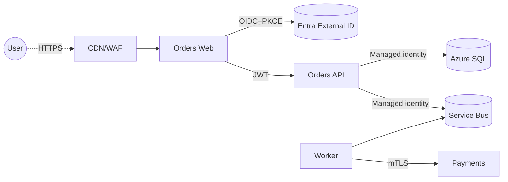

# Threat Model — Orders Service

**Status:** Accepted · **Last review:** 2026-04-12 · **Owner:** platform-security

## Scope

The Orders service: REST API + background worker + SQL DB + Service Bus topic. Handles PII (email, billing address) and PCI-adjacent data (payment intents, never card data).

## Assets

- User PII (email, name, address)
- Order history + transaction IDs
- Payment intent IDs + provider tokens
- Admin/support actions (refunds)

## Trust boundaries

Boundaries: User↔Edge, Web↔API, API↔SQL, API↔Bus, Worker↔Payments.

## STRIDE per flow

### Flow: User → Web (HTTPS)

| Threat | Description | Mitigation | Residual |
|---|---|---|---|
| S | Phishing / token theft | OIDC + PKCE, passkeys, short token TTL, secure cookies (`SameSite=Lax`, `HttpOnly`) | Low |
| T | Session fixation | Rotate session on auth, anti-forgery on POST | Low |
| I | XSS exfiltrating tokens | CSP strict, output encoding, no inline scripts | Medium (legacy admin pages) |
| D | Volumetric DDoS | CDN, Front Door, rate limit at edge | Low |

### Flow: Web → API (JWT)

| Threat | Description | Mitigation | Residual |
|---|---|---|---|
| S | Forged JWT | RS256, JWKS rotation, audience + issuer + signature checked | Low |
| T | Token replay | Short TTL (5 min), refresh tokens server-side only | Low |
| E | Scope escalation | Per-endpoint `RequireScope`/`RequireRole` policies | Low |

### Flow: API → SQL (Managed identity)

| Threat | Description | Mitigation | Residual |
|---|---|---|---|
| T | SQL injection | Parameterized queries / EF Core, no raw concat | Low |
| I | Excessive read | Row-level security on tenant boundary, app role with read-only by default | Medium |
| R | Repudiation of admin action | `audit_log` table, append-only, signed actor + before/after | Low |

### Flow: Worker → Payments (mTLS)

| Threat | Description | Mitigation | Residual |
|---|---|---|---|
| S | Man-in-the-middle | mTLS, cert pinning at provider | Low |
| T | Tampered request body | HMAC-signed body, idempotency key | Low |
| D | Payment provider down | Polly v8 circuit breaker + DLQ for retry | Low |

## Action items

- [ ] Replace legacy admin Razor Pages with Blazor + CSP (residual: I in Web flow)
- [ ] Add row-level security on `orders` table by `tenant_id` (residual: I in API→SQL flow)

## Review cadence

Quarterly + on any change crossing a trust boundary.
