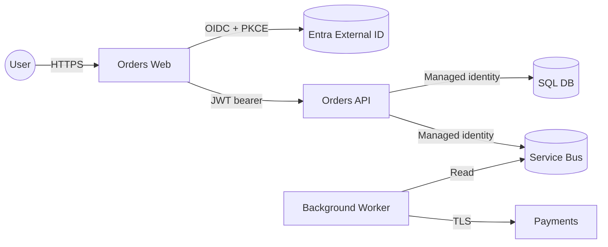

# Threat Modeling

> Systematic identification of threats per bounded context. Don't skip this — security review by intuition is unreliable.

## Core Concepts

- **STRIDE** — Spoofing, Tampering, Repudiation, Information disclosure, Denial of service, Elevation of privilege.
- **DREAD** (scoring) — Damage, Reproducibility, Exploitability, Affected users, Discoverability. Useful for prioritization but criticized for subjectivity.
- **Attack tree** — root = goal of attacker; branches = how. Useful for adversarial thinking.
- **Trust boundary** — where an authenticated/trusted context changes (network → service, service → DB, user → admin).
- **Data flow diagram (DFD)** — entities, processes, data stores, flows. Threat-model **per flow**.

## When to threat-model

- Per **bounded context** at design time
- On any change that crosses a trust boundary
- After incidents that revealed an unmodeled vector
- Annually for top-tier services

## "To Be Dangerous" Cheatsheet

| Threat | Common mitigation |
|---|---|
| **S**poofing | OIDC + PKCE, mTLS, signed tokens, anti-forgery tokens |
| **T**ampering | TLS in transit, signed/encrypted at rest, immutable audit logs |
| **R**epudiation | Audit logs (append-only), signed events, request correlation IDs |
| **I**nformation disclosure | TLS, encryption at rest, least privilege, redaction in logs |
| **D**enial of service | Rate limiting, autoscaling, CDN, WAF, circuit breakers |
| **E**levation of privilege | RBAC/ABAC, separation of duties, signed admin actions, IAM review |

## Process (1–2 hour workshop)

1. Draw a DFD with trust boundaries.
2. For each *element* (entity, process, data store) and each *flow*, walk through STRIDE.
3. For each identified threat, record: description, mitigation, residual risk, owner.
4. Track in `THREAT_MODEL.md` next to the service code.
5. Review on every architectural change.

## Quick Reference (DFD as mermaid)

## Common Pitfalls

- Modeling once, never reviewing → reality drifts from the model
- "Mitigation: WAF" — WAFs are coarse; pair with input validation and least-privilege DB access
- Forgetting *the developer* as a threat actor (supply chain, malicious dep)
- No owner on residual risk → it sits unmitigated forever

## Examples in this folder

- [`ExampleThreatModel.md`](ExampleThreatModel.md) — worked STRIDE for an order service

## See also

- [../OWASP](../OWASP/) · [../SupplyChain](../SupplyChain/) · [../ZeroTrust](../ZeroTrust/) · [../../Docs/Templates](../../Docs/Templates/)
